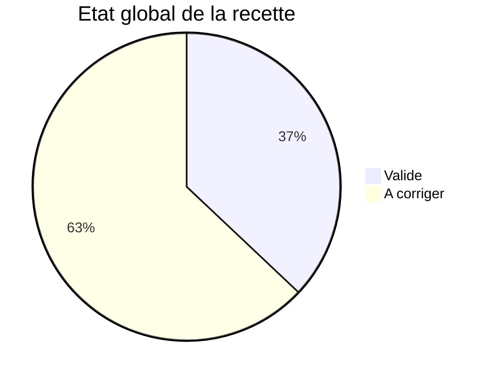
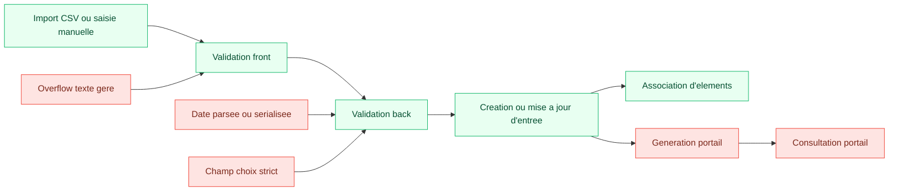
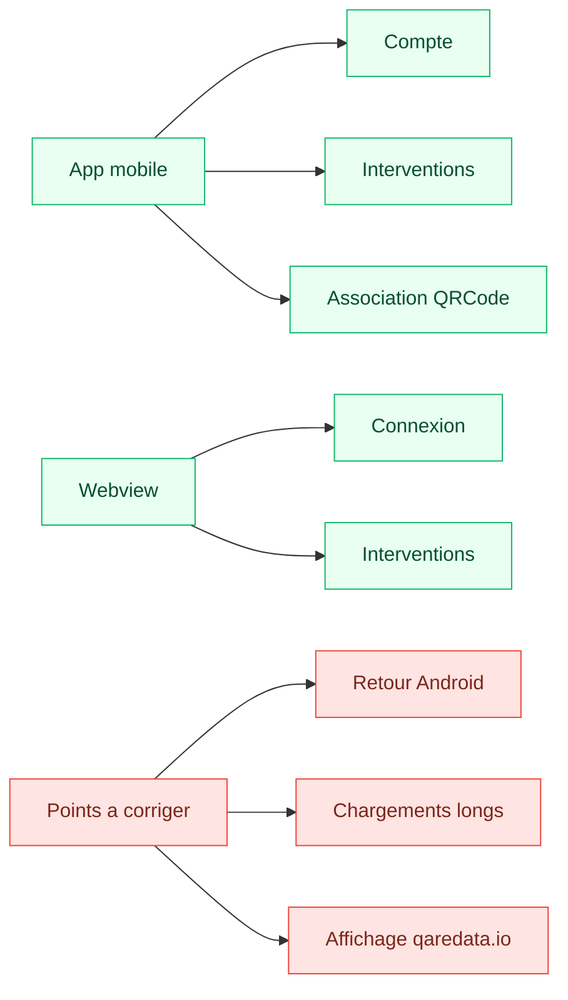
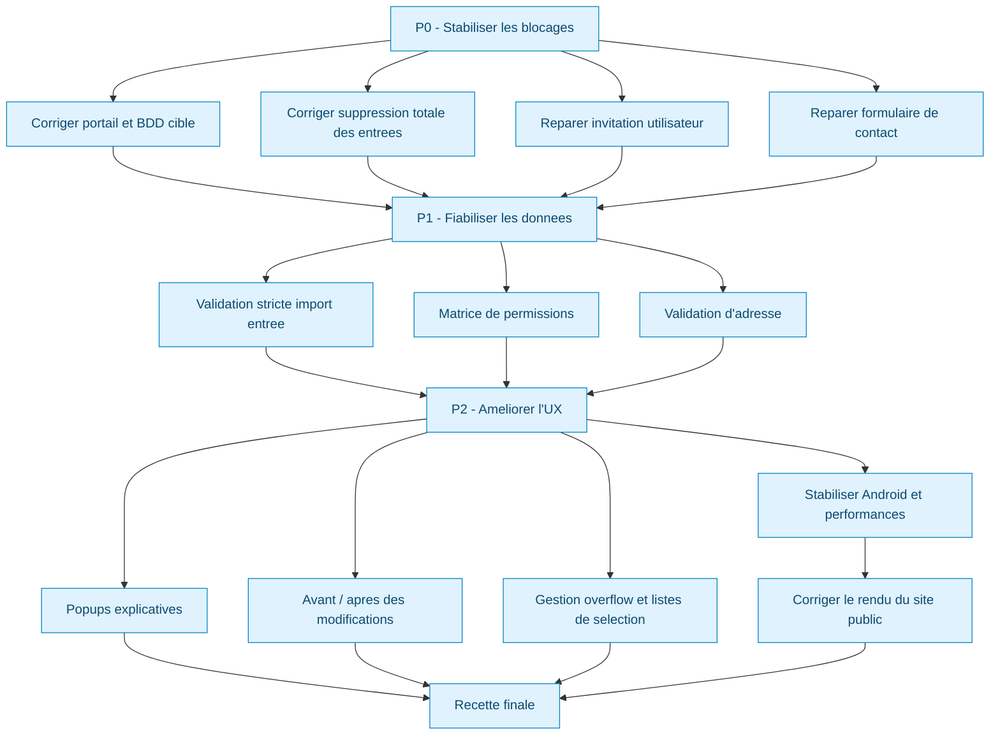

# QareData Ecosysteme - Tableau de Bord QA

> Copie restructuree de `A faire.md`
>
> Regle de lecture :
> un sujet passe en vert uniquement s'il ne reste ni anomalie, ni reserve fonctionnelle, ni correctif attendu dans les notes source.

## Theme

Le document ci-dessous suit un theme "centre de controle recette" :

- vert = flux stable ou valide
- rouge = sujet a corriger avant cloture
- bleu = conseil de correction ou de securisation

## Legend

- <strong>VALIDE</strong>
- <strong>A CORRIGER</strong>
- <strong>CONSEIL</strong>

## Vue d'ensemble

<table>
  <tr>
    <td><strong>Modules relus</strong></td>
    <td><strong>27</strong></td>
  </tr>
  <tr>
    <td><strong>Valides</strong></td>
    <td><strong>10</strong></td>
  </tr>
  <tr>
    <td><strong>A corriger</strong></td>
    <td><strong>17</strong></td>
  </tr>
  <tr>
    <td><strong>Blocages critiques</strong></td>
    <td><strong>4</strong></td>
  </tr>
</table>

```mermaid
flowchart TD
    A[Recette QareData Ecosysteme] --> B[Flux stables]
    A --> C[Correctifs a prioriser]
    B --> B1[Modele d'organisation]
    B --> B2[Liaison element vers entree]
    B --> B3[Generation de codes non assignes]
    B --> B4[Ajout d'acces exterieur]
    B --> B5[Restriction d'acces sur ajout d'intervention]
    B --> B6[Gestion du compte App]
    B --> B7[Interventions App]
    B --> B8[Association QRCode App]
    B --> B9[Connexion Webview]
    B --> B10[Interventions Webview]
    C --> C1[Blocages critiques]
    C --> C2[Coherence donnees et permissions]
    C --> C3[UX et feedback utilisateur]
    C --> C4[Bugs transverses et site web]
    C1 --> D1[Portail d'entree sur mauvaise BDD]
    C1 --> D2[Suppression totale des entrees fige l'ecran]
    C1 --> D3[Invitation utilisateur sans mail ni anti-doublon]
    C1 --> D4[Formulaire contact en erreur 500]
    C2 --> E1[Dates d'import a fiabiliser]
    C2 --> E2[Permissions QR code a verifier]
    C2 --> E3[Validation adresse organisation]
    C3 --> F1[Popups explicatifs manquants]
    C3 --> F2[Comparaison avant apres manquante]
    C3 --> F3[Overflow texte a renforcer]
    C4 --> G1[Retour Android avec ecran rose]
    C4 --> G2[Chargements parfois longs]
    C4 --> G3[Affichage qaredata.io mal echappe]

    classDef ok fill:#e8fff1,stroke:#12b76a,color:#054f31;
    classDef ko fill:#fee4e2,stroke:#f04438,color:#7a271a;
    classDef neutral fill:#eef2ff,stroke:#6366f1,color:#312e81;

    class B,B1,B2,B3,B4,B5,B6,B7,B8,B9,B10 ok;
    class C,C1,C2,C3,C4,D1,D2,D3,D4,E1,E2,E3,F1,F2,F3,G1,G2,G3 ko;
    class A neutral;
```

## Radar des priorites

### Priorite P0 - Bloquants a traiter d'abord

- <strong>Portail d'entree :</strong> le QR code est genere, mais redirige vers un portail qui ne pointe pas sur la bonne base de donnees.
- <strong>Suppression d'entrees :</strong> supprimer toutes les entrees d'une organisation grise l'ecran et bloque toute interaction.
- <strong>Invitation utilisateur :</strong> doublons possibles, aucun mail recu, rafraichissement de liste absent.
- <strong>Formulaire de contact :</strong> erreur 500 cote serveur mail.

### Priorite P1 - Correctifs fonctionnels

- <strong>Permissions :</strong> les QR codes semblent ajoutables meme sans autorisation adaptee.
- <strong>Import d'entrees :</strong> dates et comportement du champ choix a fiabiliser, plus gestion de textes longs.
- <strong>Web view :</strong> fonctionne seulement sur la webview prod, pas celle de staging.
- <strong>Acces shop :</strong> le mode QR Code Virtuel reste en anomalie.
- <strong>Android :</strong> le retour Android provoque un ecran rose.

### Priorite P2 - Qualite UX et lisibilite

- <strong>Popups de validation :</strong> manquants sur la duplication et la modification d'entree.
- <strong>Historique visuel :</strong> manque un avant/apres sur les modifications d'elements.
- <strong>Listes de selection :</strong> les QR codes deja assignes devraient disparaitre ou etre supprimables rapidement.
- <strong>Overflow :</strong> plusieurs zones de texte meritent une meilleure gestion des contenus tres longs.
- <strong>Performance :</strong> certains chargements sont notes comme un peu longs.
- <strong>Site vitrine :</strong> le site `qaredata.io` affiche parfois du markdown mal echappe sur le mot qaredata.

## Carte de synthese

| Domaine | Sujet | Statut | Lecture rapide | Correction conseillee |
| --- | --- | --- | --- | --- |
| Assets | Assigner un ou plusieurs elements | <strong>Rouge</strong> | La logique principale marche, mais la liste de QR codes a assigner manque de nettoyage ou de suppression rapide. | Filtrer les QR codes deja lies et ajouter une action de retrait immediate. |
| Assets | Consulter la web view d'un element | <strong>Rouge</strong> | Fonctionne seulement en prod. | Uniformiser la resolution d'URL entre staging et prod. |
| Assets | Dupliquer un element | <strong>Rouge</strong> | Le flux manque de feedback en cas de validation incomplete. | Ajouter une popup listant precisement les champs manquants. |
| Assets | Modifier un ou plusieurs elements | <strong>Rouge</strong> | Une partie des cas QR code fonctionne, mais le suivi des changements est trop faible. | Ajouter un recap avant/apres et tester les cas multi-selection. |
| Organisations | Creer une organisation | <strong>Rouge</strong> | Creation OK, validation d'adresse encore a verifier. | Reutiliser la logique de validation d'adresse deja presente cote QR code. |
| Organisations | Modifier le modele d'une organisation | <strong>Vert</strong> | Pas de probleme note. | Conserver tel quel et ajouter seulement une surveillance de regression. |
| Entrees | Ajouter une ou plusieurs entrees | <strong>Rouge</strong> | Ajout possible, mais controle des dates, du champ choix et des textes longs a fiabiliser. | Durcir validation front et back, plus tests d'import. |
| Entrees | Modifier une entree | <strong>Rouge</strong> | Fonctionne, mais sans recap de modification. | Ajouter une confirmation detaillee des changements en sortie. |
| Entrees | Lier des elements a une entree | <strong>Vert</strong> | Ajout propre, sans doublon ni retrait parasite. | Garder tel quel et couvrir par un test de non-duplication. |
| Entrees | Generer et consulter le portail d'une entree | <strong>Rouge</strong> | Le QR code est genere, mais pointe vers une base incoherente. | Corriger la configuration d'environnement du portail et la cible BDD. |
| Entrees | Supprimer une entree | <strong>Rouge</strong> | Suppression totale des entrees d'une organisation bloque l'interface. | Revoir l'etat vide apres suppression et la fermeture du voile gris. |
| Utilisateurs | Inviter un utilisateur | <strong>Rouge</strong> | Doublons, absence de mail et rafraichissement absent. | Ajouter anti-doublon, verification SMTP et rechargement optimiste de liste. |
| Utilisateurs | Editer les permissions d'un utilisateur | <strong>Rouge</strong> | Les assets disparaissent selon le perimetre et les QR codes semblent trop permissifs. | Revoir la matrice de droits et separer affichage de liste et autorisation d'ajout. |
| Utilisateurs | Reset du mot de passe | <strong>Rouge</strong> | Le reset marche, mais l'utilisateur n'est pas deconnecte. | Invalider les sessions existantes apres redefinition du mot de passe. |
| Support | Utiliser le formulaire de contact | <strong>Rouge</strong> | Erreur 500 sur le serveur mail. | Corriger la configuration d'envoi et journaliser le motif exact. |
| Shop | Acces au shop | <strong>Rouge</strong> | Le role qaredata passe, sauf sur QR Code Virtuel. | Isoler le mode fautif et verifier ses conditions d'acces. |
| Codes | Generer de nouveaux codes non assignes | <strong>Vert</strong> | Le flux est valide en virtuel et avec stickers. | Ajouter un test de non-regression puis ne plus y toucher. |
| Acces | Ajouter des nouveaux acces exterieur | <strong>Vert</strong> | Ajout de nom et email sans probleme. | Couvrir par un test simple de creation et d'affichage. |
| Acces | Modifier la politique de restriction des acces | <strong>Vert</strong> | Marche bien sur l'ajout d'intervention. | Etendre la recette aux autres cas avant cloture definitive. |
| App | Gestion du compte | <strong>Vert</strong> | Deconnexion, suppression et re-ajout du compte valides. | Garder un test smoke de cycle de vie du compte. |
| App | Gestion des interventions | <strong>Vert</strong> | Creation et mise a jour validees. | Ajouter un test de synchronisation et de persistance. |
| App | Association QRCode vers nouvel element | <strong>Vert</strong> | L'association d'un nouvel element a un QRCode est validee. | Conserver un test rapide sur le rattachement. |
| Webview | Page de connexion | <strong>Vert</strong> | Les domaines autorises et non autorises se comportent comme attendu. | Garder un test de filtrage de domaine. |
| Webview | Gestion des interventions | <strong>Vert</strong> | Creation et mise a jour validees, avec coherence date / heure. | Conserver un test cible sur date, heure et fuseau. |
| Mobile | Retour Android | <strong>Rouge</strong> | Le retour Android produit un ecran rose. | Inspecter la navigation et le rendu au retour d'ecran. |
| Performance | Chargements ponctuellement longs | <strong>Rouge</strong> | Certains chargements semblent anormalement lents. | Instrumenter les temps de chargement et isoler la source. |
| Site web | qaredata.io affichage du texte | <strong>Rouge</strong> | Le texte `**qaredata**` apparait parfois a la place du gras rendu. | Verifier escaping, markdown et sanitation du contenu. |

## Detail par domaine

## Assets et organisations

### Assigner un / plusieurs element(s) <strong>A CORRIGER</strong>

- <strong>Valide :</strong> l'element est bien rattache aux organisations, et les informations d'asset recuperent aussi les organisations et leurs noms.
- <strong>A corriger :</strong> un QR code deja present reste visible dans la liste des QR codes a assigner.
- <strong>A corriger :</strong> il manque une suppression rapide de type croix pour retirer un QR code deja selectionne.
- <strong>Conseil :</strong> filtrer des la source les QR codes deja lies, puis ajouter une action locale de retrait sans rechargement complet.

### Consulter la web view d'un element <strong>A CORRIGER</strong>

- <strong>A corriger :</strong> la consultation fonctionne uniquement si l'element existe dans la webview prod, pas dans celle de staging.
- <strong>Conseil :</strong> centraliser la construction de l'URL de webview dans une config d'environnement unique et testee pour staging et prod.

### Dupliquer un element <strong>A CORRIGER</strong>

- <strong>A corriger :</strong> le flux de duplication manque d'une popup claire pour expliquer ce qu'il faut completer avant validation.
- <strong>Conseil :</strong> afficher une popup recapitulant les champs obligatoires manquants et proposer un lien direct vers chacun.

### Modifier un / plusieurs element(s) <strong>A CORRIGER</strong>

- <strong>Valide :</strong> pour des QR codes de types differents, la localisation et l'organisation restent modifiables correctement.
- <strong>Valide :</strong> pour des QR codes similaires, la modification est possible sur les elements selectionnes.
- <strong>A corriger :</strong> il manque une vue avant/apres des modifications pour verifier qu'aucune information importante n'est perdue.
- <strong>Conseil :</strong> ajouter un ecran de confirmation avec diff lisible champ par champ avant enregistrement.

### Creer une organisation <strong>A CORRIGER</strong>

- <strong>Valide :</strong> la creation semble fonctionner.
- <strong>A corriger :</strong> la verification d'adresse reste a aligner avec celle utilisee pour les QR codes.
- <strong>Conseil :</strong> factoriser le composant ou le service de validation d'adresse afin d'eviter deux comportements differents.

### Modifier le modele d'une organisation <strong>VALIDE</strong>

- <strong>Valide :</strong> le comportement est note comme stable, sans probleme releve.
- <strong>Conseil :</strong> ajouter un test de regression simple et ne pas complexifier ce flux sans besoin fort.

## Entrees, import et portail

### Ajouter une / plusieurs entree(s) dans l'organisation <strong>A CORRIGER</strong>

- <strong>Valide :</strong> l'ajout d'entrees fonctionne en manuel et via fichier.
- <strong>A corriger :</strong> les noms et dates sont acceptes avec trop peu de garde-fous, avec une limite liee au comportement JavaScript.
- <strong>A corriger :</strong> l'import Excel passe globalement, mais les dates restent defectueuses pour l'instant.
- <strong>A corriger :</strong> le champ choix semble interprete selon vide ou non vide, au lieu de suivre strictement l'option attendue.
- <strong>A corriger :</strong> plusieurs zones meritent des garde-fous d'overflow pour les textes tres longs.
- <strong>Conseil :</strong> normaliser les donnees d'import cote backend, imposer un parse strict des dates et utiliser une validation enum reelle pour le champ choix.

### Modifier une entree <strong>A CORRIGER</strong>

- <strong>Valide :</strong> la modification fonctionne.
- <strong>A corriger :</strong> il manque une popup expliquant precisement ce qui a ete modifie.
- <strong>Conseil :</strong> afficher un recap resumant uniquement les champs modifies, avec anciennes et nouvelles valeurs.

### Lier un / plusieurs element(s) a une entree via cette derniere <strong>VALIDE</strong>

- <strong>Valide :</strong> l'ajout d'elements depuis l'entree est simple.
- <strong>Valide :</strong> un element deja present n'est ni duplique, ni supprime accidentellement.
- <strong>Conseil :</strong> verrouiller ce comportement par un test automatique de non-duplication et de non-suppression implicite.

### Generer et consulter le portail d'une entree <strong>A CORRIGER</strong>

- <strong>Valide :</strong> le QR code est bien genere.
- <strong>A corriger :</strong> la redirection essaye bien de partir sur `portail.qareco.de`, mais le portail ne marche pas car il ne cible pas la meme base de donnees.
- <strong>Conseil :</strong> verifier la configuration d'environnement, les secrets et le mapping de base entre le manager et le portail avant tout nouveau test fonctionnel.

### Supprimer une entree <strong>A CORRIGER</strong>

- <strong>A corriger :</strong> supprimer toutes les entrees d'une organisation laisse un voile gris et bloque toute action sur l'ecran.
- <strong>Conseil :</strong> verifier la fermeture du modal, l'etat de chargement et le rerendu de la vue vide apres suppression du dernier item.

## Utilisateurs et permissions

### Inviter un utilisateur <strong>A CORRIGER</strong>

- <strong>A corriger :</strong> on peut inviter plusieurs fois la meme entite.
- <strong>A corriger :</strong> aucun mail n'est recu.
- <strong>A corriger :</strong> la liste ne se rafraichit pas apres l'action.
- <strong>Conseil :</strong> mettre un verrou d'unicite sur email ou identifiant, tracer l'envoi SMTP et recharger la liste des invitations apres succes.

### Editer les permissions d'un utilisateur <strong>A CORRIGER</strong>

- <strong>A corriger :</strong> en editant les filtres de perimetre, certains assets disparaissent quand on ajoute des organisations.
- <strong>A corriger :</strong> des QR codes peuvent etre ajoutes meme sans autorisation adequate.
- <strong>Conseil :</strong> separer la logique de visibilite de la logique d'autorisation, puis tester chaque role sur une matrice de droits explicite.

### Reset son mot de passe <strong>A CORRIGER</strong>

- <strong>Valide :</strong> le reset de mot de passe fonctionne.
- <strong>A corriger :</strong> l'utilisateur devrait etre deconnecte apres l'operation.
- <strong>Conseil :</strong> invalider les sessions ou forcer un renouvellement de jeton apres redefinition du mot de passe.

## Support, shop et acces

### Utiliser le formulaire de contact <strong>A CORRIGER</strong>

- <strong>A corriger :</strong> erreur 500 cote serveur mail.
- <strong>A corriger :</strong> le serveur d'envoi doit etre verifie.
- <strong>Conseil :</strong> journaliser la reponse du provider mail, verifier les credentials et ajouter un message utilisateur plus explicite en cas d'echec.

### Acces au shop pour un utilisateur avec le role qaredata <strong>A CORRIGER</strong>

- <strong>Valide :</strong> l'acces au shop marche globalement bien.
- <strong>A corriger :</strong> le mode QR Code Virtuel reste en echec.
- <strong>Conseil :</strong> comparer les droits, le chargement de donnees et la route utilisee par le mode QR Code Virtuel par rapport aux autres modes deja stables.

### Generer de nouveaux codes non assignes (virtuel et avec stickers) <strong>VALIDE</strong>

- <strong>Valide :</strong> le flux est note comme fonctionnel sur les deux variantes.
- <strong>Conseil :</strong> ajouter un test de non-regression de volume et un controle du format genere.

### Ajouter des nouveaux acces exterieur <strong>VALIDE</strong>

- <strong>Valide :</strong> l'ajout de nom et email marche sans probleme remonte.
- <strong>Conseil :</strong> verifier quand meme le comportement sur emails invalides et doublons pour verrouiller le perimetre.

### Modifier la politique de restriction des acces <strong>VALIDE</strong>

- <strong>Valide :</strong> le cas d'ajout d'intervention fonctionne bien.
- <strong>Conseil :</strong> elargir la recette aux autres scenarios de restriction avant cloture complete du sujet.

## Applications mobiles, webview et site public

### Gestion de son compte - App <strong>VALIDE</strong>

- <strong>Valide :</strong> la deconnexion du compte est validee.
- <strong>Valide :</strong> la suppression du compte est validee.
- <strong>Valide :</strong> l'ajout du compte en se reconnectant est valide.
- <strong>Conseil :</strong> conserver un test smoke complet du cycle de vie du compte a chaque release mobile.

### Gestion des interventions - App <strong>VALIDE</strong>

- <strong>Valide :</strong> la creation d'une intervention est validee.
- <strong>Valide :</strong> la mise a jour d'une intervention est validee.
- <strong>Conseil :</strong> ajouter une verification simple de persistence des donnees apres fermeture et reouverture de l'app.

### Association d'un QRCode a un nouvel element - App <strong>VALIDE</strong>

- <strong>Valide :</strong> l'association d'un nouvel element a un QRCode est validee.
- <strong>Conseil :</strong> garder un test court de rattachement et un controle de non-duplication.

### Page de connexion - Webview <strong>VALIDE</strong>

- <strong>Valide :</strong> un domaine non autorise ne permet pas l'acces aux formulaires de creation d'intervention.
- <strong>Valide :</strong> un domaine autorise permet bien l'acces aux formulaires attendus.
- <strong>Conseil :</strong> verrouiller cette regle avec un test automatise ou semi-automatise sur la liste blanche de domaines.

### Gestion des interventions - Webview <strong>VALIDE</strong>

- <strong>Valide :</strong> la creation d'une intervention est validee.
- <strong>Valide :</strong> la coherence de la date et de l'heure est validee sur la creation.
- <strong>Valide :</strong> la mise a jour d'une intervention est validee.
- <strong>Conseil :</strong> garder un test specifique sur les fuseaux, l'affichage horaire et les eventuelles conversions UTC / locale.

### Bug Android - retour ecran rose <strong>A CORRIGER</strong>

- <strong>A corriger :</strong> le retour Android provoque un ecran rose.
- <strong>Conseil :</strong> verifier la navigation, le cycle de vie de l'ecran et les erreurs de rendu au moment du back systeme.

### Performance - chargement parfois long <strong>A CORRIGER</strong>

- <strong>A corriger :</strong> certains chargements sont notes comme un peu longs.
- <strong>Conseil :</strong> instrumenter les temps de chargement, isoler l'etape lente et differencier latence reseau, rendu UI et calcul local.

### Site web qaredata.io - affichage du texte <strong>A CORRIGER</strong>

- <strong>A corriger :</strong> le site peut afficher `\**qaredata**` au lieu de rendre correctement le gras sur `**qaredata**`.
- <strong>Conseil :</strong> verifier l'echappement des etoiles, le pipeline markdown et toute phase de sanitation ou de transformation HTML.

## Plan de correction recommande

## Conclusion

- <strong>Socle deja rassurant :</strong> plusieurs flux coeur sont stables, y compris sur l'app et la webview, notamment la gestion du compte, les interventions et l'association de QRCode.
- <strong>Risque principal :</strong> les sujets les plus critiques touchent la coherence des environnements, la gestion des droits, la robustesse de certains flux utilisateurs et quelques points transverses mobile / site public.
- <strong>Recommendation :</strong> traiter les P0, rejouer une recette ciblee, puis verrouiller les sujets valides par quelques tests automatiques simples pour eviter les regressions.
